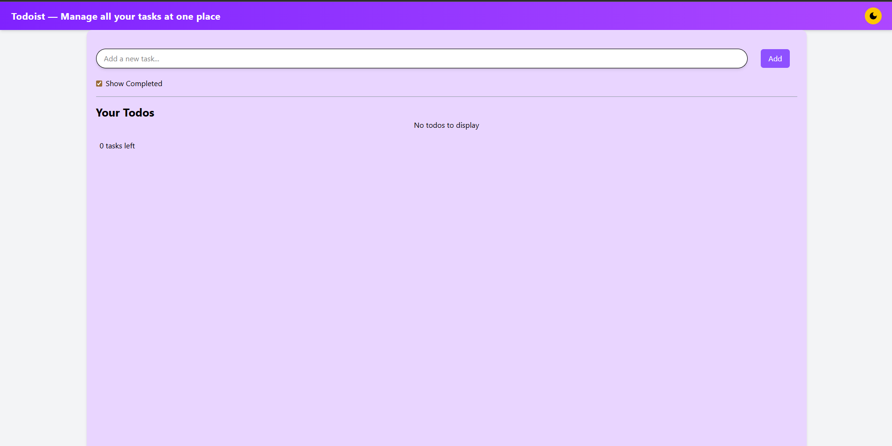
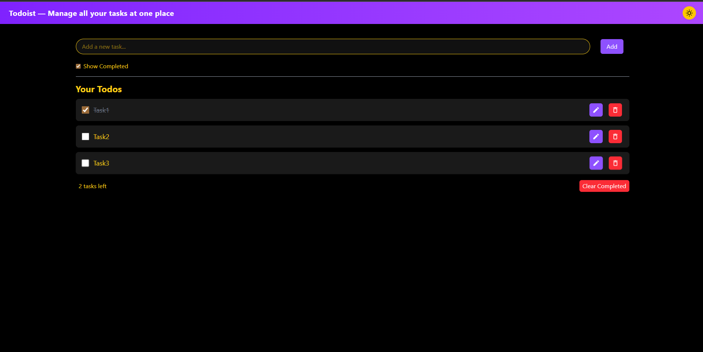

# 📝 React Todo App

<div align="center">

A modern and efficient **Todo application** built with **React + Vite + TailwindCSS** that helps users manage tasks with an intuitive interface, dark mode support, and persistent storage.

</div>

---

## 📋 Table of Contents

- [Features](#-features)
- [Tech Stack](#-tech-stack)
- [Project Structure](#-project-structure)
- [Installation & Setup](#️-installation--setup)
- [Usage](#-usage)
- [Future Improvements](#-future-improvements)
- [Author](#-author)

---

## 🚀 Features

- ✅ **Add new tasks** - Create tasks with ease
- ✏️ **Edit existing tasks** - Modify tasks as needed
- ❌ **Delete tasks** - Remove completed or unwanted tasks
- ☑️ **Mark tasks as completed** - Toggle task completion status
- 👆 **Quick toggle** - Click anywhere on a task to toggle completion
- 👀 **Show / hide completed tasks** - Filter your view
- 🌙 **Dark mode support** - Black & Yellow theme for comfortable viewing
- 💾 **Persistent storage** - Data saved in localStorage across sessions
- 📱 **Responsive UI** - Works seamlessly on all devices
- ⚡ **Lightning fast** - Built with Vite for optimal performance

---

## 🛠 Tech Stack

| Technology | Purpose |
|---|---|
| **React** | UI library |
| **Vite** | Build tool & development server |
| **TailwindCSS** | Utility-first CSS framework |
| **React Icons** | Icon library |
| **UUID** | Unique ID generation |
| **LocalStorage API** | Client-side data persistence |

---

## 📂 Project Structure

```
src/
├── components/
│   ├── Navbar.jsx
│   ├── TodoInput.jsx
│   ├── TodoList.jsx
│   └── TodoItem.jsx
├── App.jsx
├── main.jsx
├── index.css
└── theme.css
```

---

## ⚙️ Installation & Setup

### Prerequisites
- Node.js (v14 or higher)
- npm or yarn

### Steps

1. **Clone the repository**
```bash
git clone https://github.com/YOUR_USERNAME/react-todo-app.git
cd react-todo-app
```

2. **Install dependencies**
```bash
npm install
```

3. **Start the development server**
```bash
npm run dev
```

4. **Open in your browser**
```
http://localhost:5173
```

---

## 🎯 Usage

### Adding Tasks
- Type your task in the input field and click "Add" or press Enter

### Completing Tasks
- Click on any task to mark it as completed
- Completed tasks will be visually distinguished

### Editing Tasks
- Click the edit icon to modify a task

### Deleting Tasks
- Click the delete icon to remove a task

### Dark Mode
- Toggle dark mode using the button in the navbar
- Your preference is saved and persists across sessions

---

## 🌟 Key Features Explained

### 🌙 Dark Mode
The app supports a beautiful dark mode with a black and yellow theme. Your theme preference is automatically saved to localStorage, ensuring it persists even after closing the browser.

### 💾 Persistent Todos
All your tasks are stored in the browser's localStorage. No data is lost when you refresh the page or close the browser. Your todos are always there when you return!

---

## 📸 Screenshots





---

## 🚧 Future Improvements

- 🔍 Search functionality for tasks
- 📅 Due dates and reminders
- 🏷️ Priority labels and tags
- 📊 Task statistics and progress tracking
- 🔗 Backend integration (Node.js / Firebase)
- 🌐 Cloud sync across devices
- 📱 Mobile app version

---

## 👨‍💻 Author

**Durga Prasad**

- 🔗 GitHub: [@sleepingCoder7](https://github.com/sleepingCoder7)

---

<div align="center">

⭐ If you find this project helpful, please consider giving it a star! ⭐

</div>